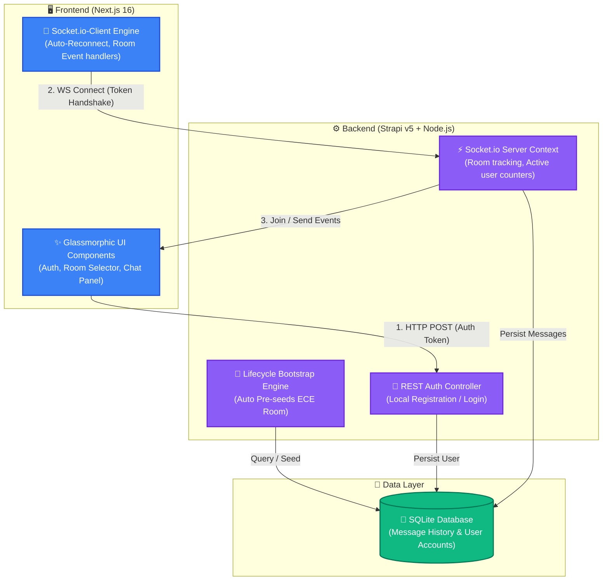

# 🌌 Real-Time College Department Chat Hub

A premium, state-of-the-art real-time chat application for college departments. Designed with rich glassmorphism aesthetics, dynamic micro-interactions, robust authentication, and instant messaging capabilities powered by a decoupled **Next.js** frontend and **Strapi v5** backend with a custom-engineered **Socket.io** integration.

---

## 🏛️ System Architecture

The application is structured as a decoupled Monorepo where the **Next.js Frontend** communicates with the **Strapi Backend** via traditional RESTful APIs for authentication and via a dedicated, persistent **Socket.io** connection for bidirectional real-time communications.



---

## ✨ Features & Polish

### 💎 Rich Premium Aesthetics
* **Glassmorphic Cards:** High-fidelity layout with semi-transparent frosted backdrops, neon glow highlights, and subtle border shadows.
* **Modern Typography:** Styled with smooth, tailored dark mode variables, curated gradients (`from-indigo-600 to-purple-600`), and reactive micro-interactions.
* **Dynamic Sidebar:** A living active users list that updates in real-time as classmates join and leave rooms.

### 🏫 XYZ College Department Rooms
* Users can join targeted academic rooms via a secure dropdown:
  * **Electronics & Communication Engineering (ECE)** 📡 *(Pre-seeded)*
  * **Computer Science Engineering (CSE)** 💻
  * **Civil Engineering (Civil)** 🏗️
  * **Mechanical Engineering (Mech)** ⚙️

### 🌱 Automated ECE Pre-Seeding
* On startup, the backend automatically seeds the **ECE Room** with a highly realistic, engaging conversation between students (`Aarav`, `Diya`, `Kabir`, `Ananya`) discussing their upcoming hectic exam schedule, lab vivas, and exam prep.

### 🛡️ Production-Grade Quality Assurance
* **Input Validation:** Prevents sending empty messages, white spaces, or entering room chats without a registered username.
* **Size Enforcement:** Limits usernames and messages (up to 500 characters) on both client and server sides to block overflow abuse.
* **Authenticated Socket Handshake:** The backend verifies JWT tokens securely during the socket connection phase.
* **Auto-Reconnection Logic:** Next.js socket client auto-rebuilds connections gracefully in case of intermittent network drops.

---

## 🛠️ How We Made It

### 1. The Design System
We designed a modern web aesthetic entirely from scratch inside `frontend/src/app/globals.css`, defining glassmorphism tokens (`backdrop-blur-md`, custom gradients, elegant scrolling tracks) using vanilla CSS variables alongside modern **Tailwind CSS**. We replaced traditional static inputs with floating focus rings and reactive hover transitions.

### 2. High-Performance Socket Connection
We decoupled socket event flows from standard Next.js rendering cycles using persistent `useRef` and active `useEffect` hooks. The connection dynamically reads the window server port in development to avoid hardcoded IP addresses, allowing multiple browser tabs to collaborate concurrently.

### 3. Asynchronous Strapi Seeding
We configured the Strapi initialization sequence inside `backend/src/index.ts`. By hijacking the asynchronous `bootstrap` lifecycle, we check for existing chat logs. If clean, we tap Strapi's `entityService` to inject high-fidelity mock conversations for ECE directly into SQLite, making it immediately available on client login.

---

## 🚀 Setup & Launch

### Prerequisites
* **Node.js:** `>= v20.0.0`
* **NPM:** `>= v10.0.0`

### 1. Install & Boot the Strapi Backend
```bash
# Navigate to the backend directory
cd backend

# Install dependencies
npm install

# Run database migrations and start development server
npm run dev
```
* Once launched, visit [http://localhost:1337/admin](http://localhost:1337/admin) to register your admin user, or connect instantly through the Next.js client.

### 2. Install & Boot the Next.js Frontend
```bash
# Open a new terminal and navigate to the frontend directory
cd frontend

# Install dependencies
npm install

# Launch the dev server
npm run dev
```
* Open your browser and navigate to [http://localhost:3000](http://localhost:3000) to begin testing!

---

## ☁️ Railway.app Deployment Guide

This mono-repo configuration is fully containerization-ready and supports frictionless deployment on [Railway.app](https://railway.app/) using two distinct target services pointed to the same repo branch.

### 1. Backend Service (Strapi)
1. Add a **New -> GitHub Repo** service on Railway.
2. Under service settings, set the **Root Directory** to `/backend`.
3. Add the following **Variables**:
   * `NODE_ENV`: `production`
   * `HOST`: `0.0.0.0`
   * `APP_KEYS`: `your-random-app-key-1,your-random-app-key-2`
   * `API_TOKEN_SALT`: `your-api-token-salt`
   * `ADMIN_JWT_SECRET`: `your-admin-jwt-secret`
   * `TRANSFER_TOKEN_SALT`: `your-transfer-token-salt`
   * `JWT_SECRET`: `your-jwt-secret`
4. Mount a persistent **Volume** at `/app/.tmp` in service settings to preserve your SQLite database across deployments.

### 2. Frontend Service (Next.js)
1. Add a second service from the same GitHub repo.
2. In service settings, set **Root Directory** to `/frontend`.
3. Set the following **Variables**:
   * `NEXT_PUBLIC_STRAPI_URL`: *Your Backend Service's Generated Public Domain* (e.g. `https://backend-service.up.railway.app`).
4. Generate a public domain for the frontend service in Railway settings and open it!
